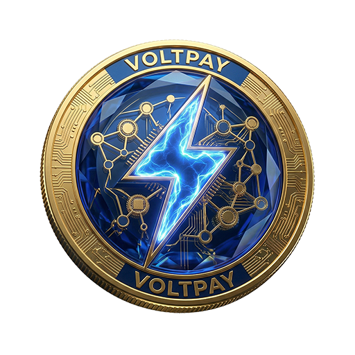

  

# VoltPay (VLT) - Official Smart Contract Repository ⚡

VoltPay is a next-generation Web3 ecosystem designed to simplify digital payments by combining blockchain infrastructure with artificial intelligence.

This repository contains the **official verified VoltPay V2 Mainnet smart contract**, final project documentation, and security references for the VoltPay ecosystem.

---

## 📄 Verified Smart Contract

- **Network:** BNB Smart Chain (BSC Mainnet)
- **Chain ID:** `56`
- **Contract Address:** `0xE90714e6e4becEc65F33D3099F95B42B6e3168aE`
- **VLT / WBNB Pair:** `0x6cFF8650a2e8Affd64a48eaf227A0C74cE767892`
- **PancakeSwap V2 Router:** `0x10ED43C718714eb63d5aA57B78B54704E256024E`
- **Compiler:** Solidity `0.8.35`
- **Optimizer:** Enabled — `200 runs`
- **EVM Version:** `paris`
- **Verification:** BscScan — **Exact Match**
- **Trading Status:** Disabled until official launch

🔎 **BscScan:**  
https://bscscan.com/address/0xE90714e6e4becEc65F33D3099F95B42B6e3168aE#code

---

## 🔐 Final Contract Source

Official Mainnet source:

`VoltPayV2_FINAL_0_8_35.sol`

**SHA-256**

`9d708e7e874bdf72533d1f59d976049dfeeff9f3555aeccfd4c2bfdc94cbcdae`

The Solidity source is frozen and corresponds to the contract deployed and verified on BNB Smart Chain Mainnet.

---

## 📊 Tokenomics & Security

VoltPay has a fixed, non-inflationary total supply of:

**200,000,000 VLT**

### Final Distribution

- **50%** — Strategic Reserve — Locked — `100,000,000 VLT`
- **12.5%** — Liquidity Reserve — `25,000,000 VLT`
- **10%** — Founder Allocation — `20,000,000 VLT`
- **7.5%** — Presale — `15,000,000 VLT`
- **7.5%** — Ecosystem & Partnerships — `15,000,000 VLT`
- **5%** — Team — Vesting — `10,000,000 VLT`
- **5%** — Marketing & Community — `10,000,000 VLT`
- **2.5%** — Development & Operations — `5,000,000 VLT`

**Total: 200,000,000 VLT — 100%**

Team allocation is planned with a **3-month cliff** followed by **12-month linear vesting**.

---

## 💰 Fee Model

VoltPay uses a transaction-based fee structure:

- **Buy Fee:** `2%`
- **Sell Fee:** `4%`

Collected fees accumulate in the smart contract and are processed through the `processFees()` mechanism.

Processed fees are allocated:

- **50% → Liquidity**
- **50% → Treasury**

This design separates fee accumulation from normal user transfers and supports controlled liquidity and treasury processing.

---

## 🛡️ Security Validation

VoltPay V2 completed extensive testing and security validation before Mainnet deployment:

- ✅ `93/93` local Hardhat tests passed
- ✅ BSC Mainnet fork test passed
- ✅ Total automated result: `94/94 PASS`
- ✅ Mythril security analysis completed
- ✅ SolidityScan Security Score: `93.18`
- ✅ Critical findings: `0`
- ✅ High findings: `0`
- ✅ Medium findings: `0`
- ✅ Live BSC Testnet validation completed
- ✅ Buy fee validation: PASS
- ✅ Sell fee validation: PASS
- ✅ Anti-whale validation: PASS
- ✅ Fee processing validation: PASS
- ✅ Treasury pull-payment validation: PASS
- ✅ Post-renounce fee processing validation: PASS

---

## 🔒 Contract Safety Features

VoltPay V2 includes:

- Fixed non-inflationary supply
- No minting function
- One-way trading activation
- Fees can only be reduced
- Permanent fee locking
- Permanent configuration locking
- Permanent swap-settings locking
- Removable anti-whale limits
- Manual fee processing
- Pull-payment treasury mechanism
- Controlled ownership renouncement process

---

## 🌐 VoltPay Ecosystem

VoltPay is designed as a utility-driven payments ecosystem.

Current and planned components include:

- 💳 Non-custodial VoltPay Wallet
- 📱 Telegram Wallet integration
- 🤖 VoltAI assistant
- 💵 Fiat on-ramp integrations
- 📲 Mobile wallet applications
- 🧩 Chrome wallet extension
- 🏪 Merchant payment integrations
- ⚡ Sponsored VLT transfers inside VoltPay Wallet
- 🤝 Ecosystem partnerships

---

## 📚 Official Documents

- **Whitepaper:** `VoltPay_VLT_Whitepaper_Final_Mainnet_Edition_August_2026.pdf`
- **Tokenomics:** `VoltPay_VLT_Tokenomics_Strict_Mainnet_Edition_August_2026.pdf`

---

## 🔎 Transparency

VoltPay intends to publish verifiable on-chain proof for:

- 🔐 Strategic Reserve lock
- 👥 Team vesting
- 💧 Liquidity lock
- 🥞 Mainnet liquidity pool
- 🚀 Presale allocation
- 🏦 Relevant treasury and ecosystem wallets

These references will be added to this repository as they are completed.

---

## 🔗 Official Links

- 🌐 **Website:** https://voltpay.org
- ✉️ **Email:** info@voltpay.org
- 💻 **GitHub:** https://github.com/volt-pay
- 𝕏 **X / Twitter:** https://x.com/VoltPayInfo
- ✈️ **Telegram:** https://t.me/VoltPayorg
- 💬 **Discord:** https://discord.com/invite/NYcPsXY4jG

---

## ⚠️ Disclaimer

Cryptocurrency markets involve substantial risk.

VoltPay does not guarantee token price appreciation, investment returns, market liquidity, or future exchange listings.

Users should independently review the smart contract, documentation, and on-chain data before interacting with VLT.

---

  <strong>© 2026 VOLT-LABS LLC. All Rights Reserved.</strong> 
  Powered by BNB Smart Chain | voltpay.org

